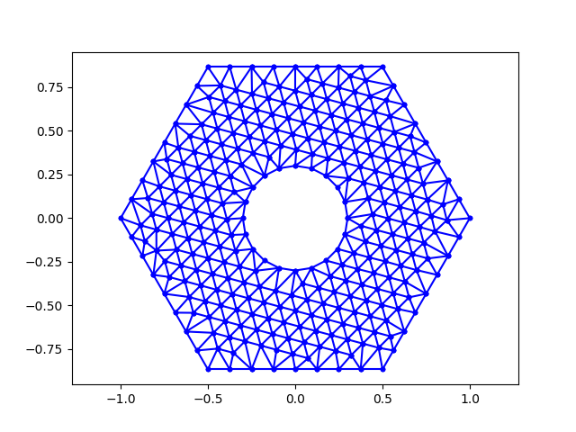

# Poisson-FEM
Poisson Equation **F**inite **E**lement **M**ethod

Реализован метод конечных элементов для численного решения уравнения Пуассона.\
Триангуляция и непосредственный метод конечных эелементов написаны на C и Python.

Пример работы триангуляционного алгоритма:

